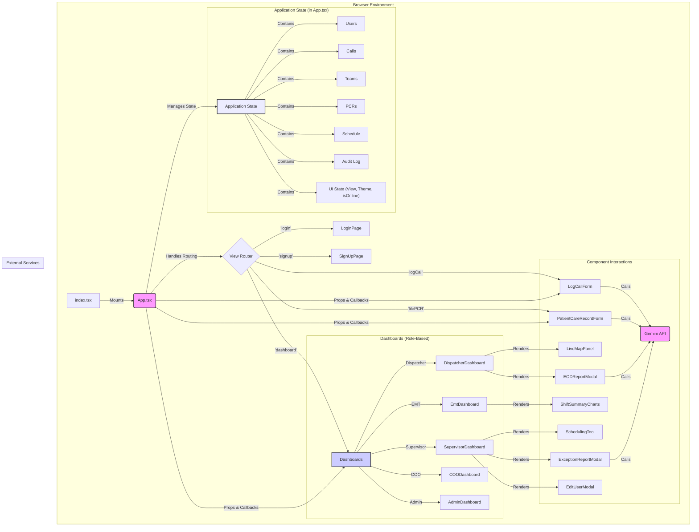
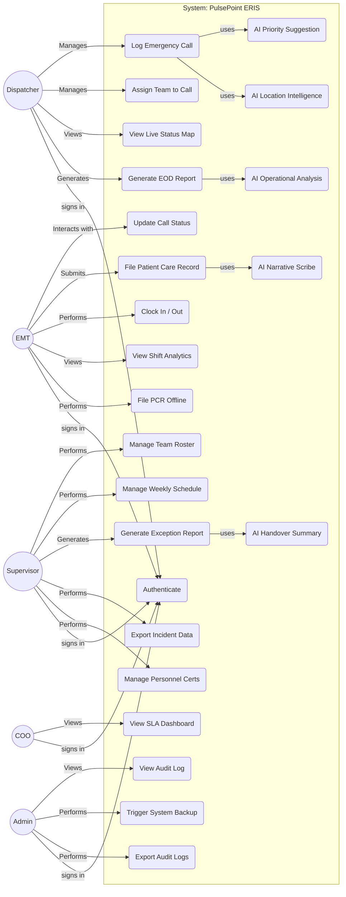
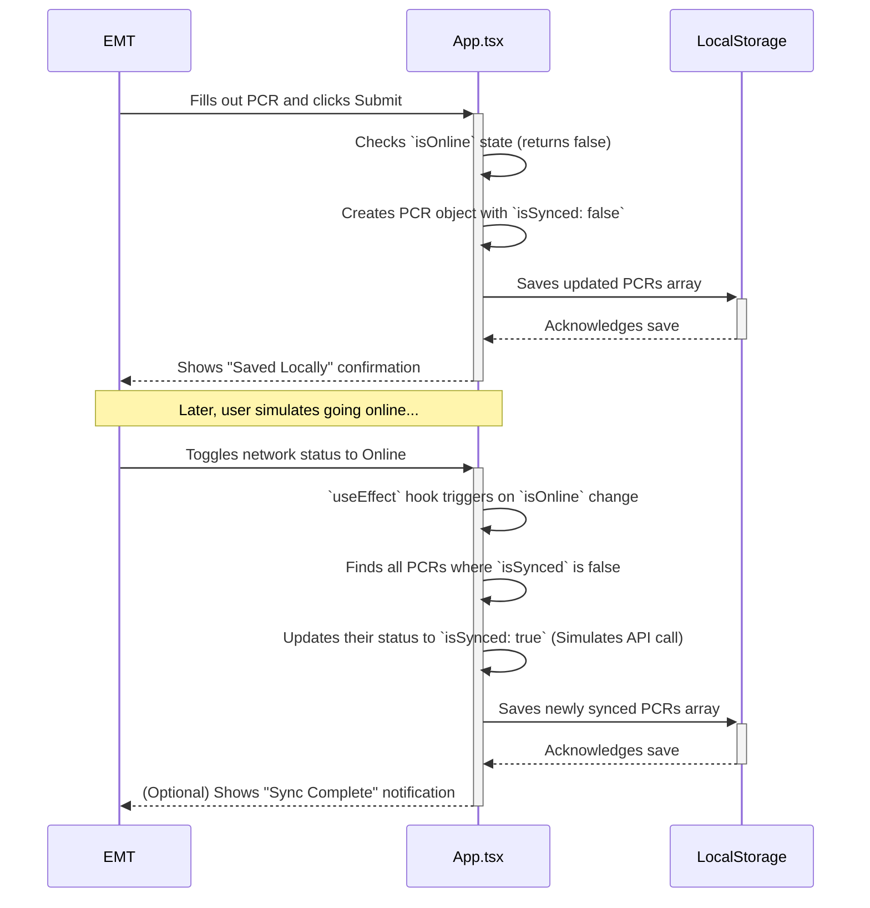

# PulsePoint ERIS - Detailed Technical Documentation

This document provides a comprehensive technical overview of the PulsePoint ERIS application, intended for developers, system architects, and technical project managers. It covers system architecture, state management, component design, key workflows, and non-functional requirements.

---

## 1. System Architecture

PulsePoint ERIS is architected as a **client-side, single-page application (SPA)** built with React. It operates entirely in the browser, with application state managed centrally in the root `App.tsx` component. This design makes it highly portable and easy to deploy. In a production environment, it would connect to a dedicated backend via a REST or GraphQL API for data persistence, real-time updates (likely via WebSockets), and business logic execution.

### 1.1. Technology Stack

-   **React (v19):** The core UI library for building the component-based interface.
-   **TypeScript:** Provides static typing for improved code quality, developer experience, and maintainability.
-   **Tailwind CSS:** A utility-first CSS framework used for rapid and consistent styling, including responsive design and dark mode.
-   **Chart.js:** A charting library used to render data visualizations in the EMT, Supervisor, and COO dashboards.
-   **@google/genai (Gemini API):** Integrated to provide a suite of AI-powered features:
    -   **`gemini-2.5-flash`:** For fast, general-purpose tasks like initial call priority suggestion and generating shift handover summaries.
    -   **`gemini-2.5-flash` with Google Maps Grounding:** To provide real-world, up-to-date geographical context for incident locations.
    -   **`gemini-2.5-flash-lite`:** For extremely low-latency tasks, such as the real-time AI Scribe for EMTs.
    -   **`gemini-2.5-pro`:** For more complex reasoning and analytical tasks, such as generating qualitative insights for the End of Day report.

### 1.2. Rendered Architecture Diagram

The following diagram illustrates the high-level architecture, component relationships, and data flow within the application. The `App.tsx` component acts as the central orchestrator.

### 1.3. Data Flow

The application follows a strict **unidirectional data flow** pattern:

1.  **State:** All application data (calls, teams, etc.) is held in the root `App.tsx` component using `React.useState`.
2.  **Props:** State is passed *down* to child components as read-only props. Components render themselves based on the props they receive.
3.  **Callbacks:** When a user interacts with a child component (e.g., clicks a button), the component invokes a callback function (e.g., `onAssignTeam`) that was also passed down as a prop from `App.tsx`.
4.  **State Update:** The callback function executes within `App.tsx`, updating the central state.
5.  **Re-render:** React detects the state change and re-renders `App.tsx` and any child components whose props have changed, ensuring the UI is always in sync with the state.

This pattern makes the application predictable and easier to debug, as state modifications are centralized and explicit.

## 2. Use-Case Diagram

This diagram outlines the primary actors and their interactions with the PulsePoint ERIS system.

## 3. State Management

### 3.1. Philosophy

State is managed centrally within the `App.tsx` component using `React.useState`. This approach was chosen for its simplicity and is highly effective for an application of this scale. It avoids the boilerplate of more complex state management libraries like Redux while maintaining a clear and predictable data flow.

### 3.2. Core State Slices

-   `users: User[]`: Stores all user objects. Used for authentication and team member assignment.
-   `calls: EmergencyCall[]`: The master list of all incidents. This is the most frequently updated piece of state.
-   `teams: Team[]`: Stores all response teams, their members, grade, base station, and current status.
-   `pcrs: PatientCareRecord[]`: A collection of all submitted Patient Care Records, linked by `callId`.
-   `schedule: Schedule`: A data structure representing the weekly shift assignments for all teams.
-   `auditLog: AuditLogEntry[]`: A chronological log of significant user actions for administrative review.
-   `loggedInUser: User | null`: The object of the currently authenticated user, which determines their role and permissions.
-   `view: AppView`: A string that controls which primary component or "page" is rendered (e.g., 'login', 'dashboard', 'logCall').
-   `isDarkMode: boolean`: A boolean flag that controls the application's light/dark theme.
-   `isOnline: boolean`: A boolean flag used to simulate network connectivity for testing offline capabilities.
-   `callToEdit: EmergencyCall | null`: Temporarily stores the call object for which a PCR is being filed.
-   `confirmationMessage: string`: Stores the message to be displayed on the confirmation page.

## 4. Component Deep Dive

### `App.tsx`
The root component and central nervous system of the application. It is responsible for:
-   Initializing and managing all application state.
-   Containing all state-mutating logic (e.g., `handleLogCallSubmit`, `handleUpdateUser`).
-   Containing the audit logging function `logAuditEvent`.
-   Implementing the simulated offline sync logic in a `useEffect` hook.
-   Passing state and callback functions down to child components as props.
-   Rendering the correct view or dashboard based on the `view` and `loggedInUser` state.

### Role-Based Dashboards
-   **`DispatcherDashboard.tsx`**: A feature-rich interface displaying pending incidents, available teams, and the `LiveMapPanel`. It provides entry points for logging new calls and generating an `EODReportModal`.
-   **`EmtDashboard.tsx`**: A streamlined view focused on the EMT's active assignment. It now includes offline status indicators and shows sync status for filed PCRs.
-   **`SupervisorDashboard.tsx`**: A multi-tab operational overview. It now includes a "Personnel Management" tab for editing user certifications via the new `EditUserModal`, in addition to its existing team roster and scheduling capabilities.
-   **`COODashboard.tsx`**: An executive-level dashboard focused on Service Level Agreement (SLA) analytics.
-   **`AdminDashboard.tsx`**: A simple interface for viewing the immutable `auditLog`, now with functionality to export the log to a CSV file.

### Key UI & Logic Components
-   **`PatientCareRecordForm.tsx`**: A form for EMTs to file reports. The "AI Scribe" feature has been enhanced with a "Use Narrative" button to copy the AI-generated text to the main notes field, allowing for review and editing.
-   **`ExceptionReportModal.tsx`**: This modal for supervisors now includes a "Regenerate" button, allowing them to get an updated AI summary if the situation changes before a shift handover.
-   **`EditUserModal.tsx`**: A new modal used by supervisors to edit user details. Currently, it allows for updating an EMT's certifications.

## 5. Key Workflow Diagrams

### 5.1. Offline PCR Submission – EMT Flow

This diagram shows how the system handles PCR submissions when the application is in a simulated offline state.

## 6. Key Workflows & Business Logic

### 6.1. Offline PCR Syncing
-   **State**: A new boolean state, `isOnline`, is managed in `App.tsx` and can be toggled via the `NavBar` for simulation.
-   **Submission**: When `handleFilePCRSubmit` is called, it checks `isOnline`. If `false`, the new `PatientCareRecord` object is created with an `isSynced: false` property.
-   **Synchronization**: A `useEffect` hook in `App.tsx` is dependent on the `isOnline` state. When `isOnline` changes to `true`, the effect triggers, finds all PCRs with `isSynced: false`, and updates them to `isSynced: true`, simulating a sync process. A `setTimeout` mimics network latency.

### 6.2. Personnel & Team Management
-   **Editing Certs**: A supervisor can now edit an EMT's certifications. This is handled by a new `handleUpdateUser` function in `App.tsx`. The `SupervisorDashboard` renders an `EditUserModal`, which, upon saving, calls this function to update the central `users` state.
-   **Informed Team Building**: The `SupervisorDashboard`'s "Edit Team" modal now displays the certifications of each EMT, allowing the supervisor to make more strategic decisions when assigning members to a team. The main team roster table also displays a summary of member certifications.

## 7. Non-Functional Requirements

-   **Performance**: `React.useMemo` is used extensively in dashboards to memoize filtered and sorted lists, preventing costly re-calculations on every render.
-   **Data Integrity**: In the absence of a backend, the application ensures data integrity by centralizing all state mutations in `App.tsx`. For example, assigning a user to a team (`handleUpdateTeam`) updates both the `teams` and `users` state slices to maintain consistency.
-   **Accessibility (A11y)**: The application incorporates semantic HTML, ARIA roles, `htmlFor` attributes, and ensures interactive elements are keyboard-focusable.
-   **Responsiveness**: Tailwind CSS's mobile-first utility classes are used to ensure the layout adapts seamlessly from large desktop monitors to mobile devices.

## 8. Conclusion & Future Work

PulsePoint ERIS is now a feature-complete prototype that demonstrates all core workflows specified in the product backlog. The addition of offline capabilities, advanced supervisor controls for personnel management, and enhanced AI interactions successfully meet the project's design goals.

The logical next phase is to evolve the application into a production-ready, multi-user system. The roadmap remains focused on:

1.  **Backend Integration:** Develop a robust backend service (e.g., using Node.js, Python, or Go) to manage a persistent database (e.g., PostgreSQL).
2.  **Real-Time Communication:** Replace the `setInterval` map simulation with a real-time solution using WebSockets for instantaneous updates across all connected clients.
3.  **Authentication & Security:** Implement a secure authentication system using JWTs.
4.  **Scalability & Deployment:** Containerize the application using Docker for consistent, scalable deployments on cloud platforms.